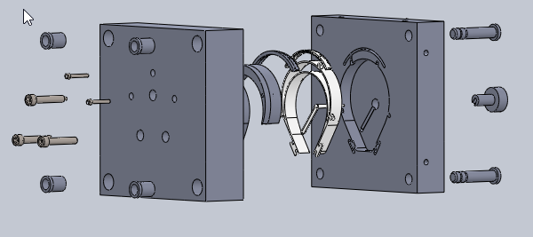
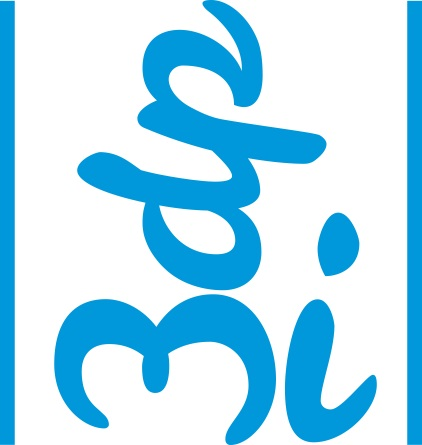

# (nombre proyecto)
### Matriz de inyección de plástico Open-Source para protectores faciales.

(fundamentación)

## (especificación tecnica)
(imagen, materiales, tiempos, costos estimados)
(citar informes y conclusión)

## Licencia

Atribución-NoComercial-CompartirIgual 4.0 Internacional (CC BY-NC-SA 4.0)
https://creativecommons.org/licenses/by-nc-sa/4.0/deed.es

## (participantes)

(agregar nombre, logo, redes, rol)

